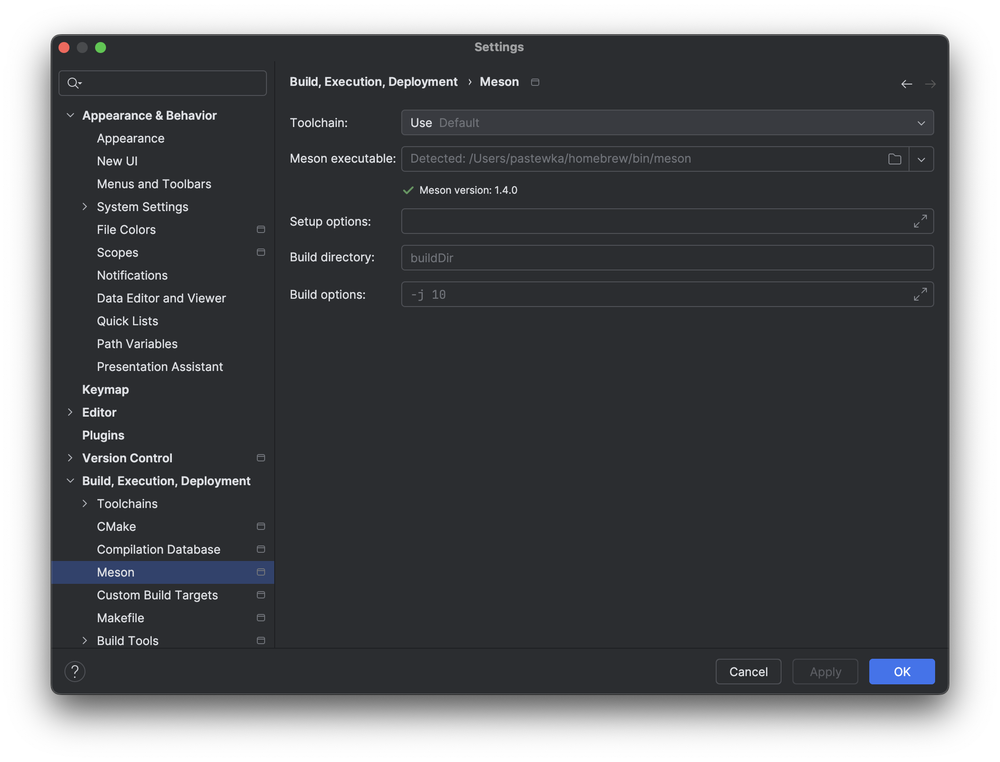

# Meson

[Meson](https://mesonbuild.com/) is a tool that helps with compilation of C/C++ of
more than just a few standalone files. We have seen in ["Organizing Code in
C++"](code_organization.md) that compiling C++ files is usually done in two
stages, the creation of object files and the linking of those objects. Meson
will generate these compilation steps for you, provided you give it the right
information about your project. In addition, Meson has the following advantages:

- Cross-platform: the workflow to compile Meson project is identical accross
  platforms, Meson will automatically identify the relevant compilers,
  dependencies, etc., to use for your particular platform.
- It correctly handles library dependencies: these can be hard to setup
  manually, especially in high-performance cluster environments.
- Many IDEs recognize Meson projects: among them CLion and VScode.

## Adding subdirectories with separate executables

For organizing your milestone codes, it can be useful to have seperate `main.cpp` files in seperate subdirectories that correspond to each milestone. A possible directory structure could look like this:
```
milestones/
  meson.build
  01/
    meson.build
    main.cpp
  ...
  04/
    meson.build
    main.cpp
    lj54.xyz
  ...
```
Each subdirectory contains a `meson.build` that tells `Meson` what to do. You can tell `Meson` to add a subdirectory using the `subdir` command. The toplevel `meson.build` requires an additional statement
```meson
subdir('milestones')
```
and `meson.build` in the `milestones` subdirectory looks as follows:
```meson
subdir('01')
subdir('02')
subdir('03')
...
```
In each of the milestone directories we need to tell `Meson` to compile an executable and that `main.cpp` (in this directory) contains the `main` function. Additionally, it is useful to tell `Meson` about dependent files, e.g. the file `lj54.xyz` that is required to execute Milestone 04. The corresponding `meson.build` looks like this:
```meson
executable(
  'milestone04',
  'main.cpp',
  include_directories : [md_incdirs],
  link_with : [md_lib],
  dependencies : [eigen, mpi]
)

fs = import('fs')
fs.copyfile('lj54.xyz')
```
The statement `executable` contains all source and headers files required to compile the code. The variables `eigen` and `mpi` are defined in the toplevel `meson.build` and can be used here.

In `CLion`, these additional executables should show up as build targets:


## Debug vs. release builds

By default, `CLion` (and `Meson`) will configure debug builds. These builds are useful for development purposes, but their performance can be terrible. For running longer calculations it is useful to switch to a release build. This behavior is controlled by the `--buildtype=` option of the `Meson` build system. From the command line, it can be set by executing
```bash
meson setup builddir --buildtype=debug
```
In `CLion`, you can configure this in the menu option `File->Settings->Build, Execution, Deployment->Meson`. You should see the following dialog:



Add the build type to `Setup options`.