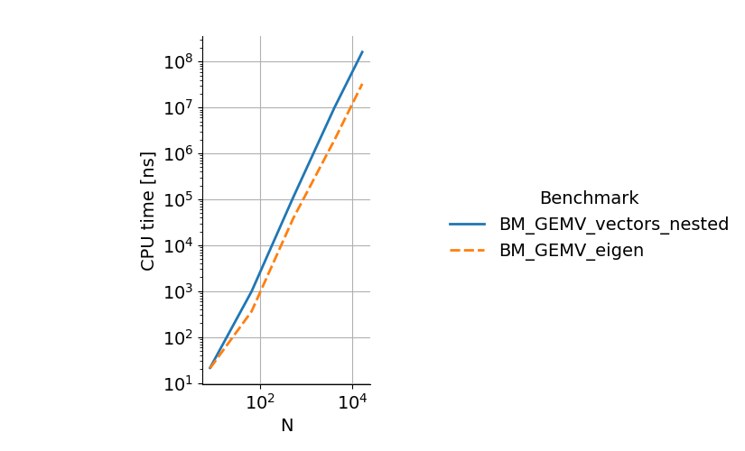

# Benchmarking & Performance Analysis

We'll start with the following files:

- [meson.build](benchmarks/meson.build)
- [gemv_benchmarks.cpp](benchmarks/gemv_benchmarks.cpp)
- [plot_benchmark.py](benchmarks/plot_benchmark.py)

To compile, you need to instruct Meson to download Google benchmark:
```bash
mkdir subprojects
meson wrap install google-benchmark
```

Once compiled, you can run the benchmark:
```
$ ./bench
2023-05-16T17:02:01+02:00
Running ./bench
Run on (16 X 4700 MHz CPU s)
CPU Caches:
  L1 Data 48 KiB (x8)
  L1 Instruction 32 KiB (x8)
  L2 Unified 1280 KiB (x8)
  L3 Unified 18432 KiB (x1)
Load Average: 0.27, 0.38, 0.34
***WARNING*** CPU scaling is enabled, the benchmark real time measurements may be noisy and will incur extra overhead.
-----------------------------------------------------------------------
Benchmark                             Time             CPU   Iterations
-----------------------------------------------------------------------
BM_GEMV_vectors_nested/8           22.9 ns         22.9 ns     31588058
BM_GEMV_vectors_nested/64          1060 ns         1060 ns       651695
BM_GEMV_vectors_nested/512       110290 ns       110262 ns         6285
BM_GEMV_vectors_nested/4096    10523839 ns     10523361 ns           66
BM_GEMV_vectors_nested/16384  161720614 ns    161711957 ns            4
BM_GEMV_vectors_nested_BigO        0.60 N^2        0.60 N^2
BM_GEMV_vectors_nested_RMS            1 %             1 %
BM_GEMV_eigen/8                    23.8 ns         23.8 ns     29430446
BM_GEMV_eigen/64                    395 ns          395 ns      1780985
BM_GEMV_eigen/512                 40374 ns        40364 ns        17419
BM_GEMV_eigen/4096              2307290 ns      2307168 ns          303
BM_GEMV_eigen/16384            37415095 ns     37404881 ns           19
BM_GEMV_eigen_BigO                 0.14 N^2        0.14 N^2
BM_GEMV_eigen_RMS                     0 %             0 %
```

You can see that the eigen benchmark is approximately 4 times faster than the
nested vectors benchmark. To plot the data, one can use the `plot_benchmark.py`
script (which requires [Pandas](https://pandas.pydata.org/) and
[Seaborn](https://seaborn.pydata.org/)):

```bash
./bench --benchmark_format=csv | ../plot_benchmark.py
```

which gives the following plot:



## Microbenchmarking with google/benchmark

[Benchmark](https://github.com/google/benchmark) is a C++ micro-benchmarking
library that follows the same design principles as
[googletest](https://github.com/google/googletest). It automatically tries to
estimate the number of executions of a piece of code to get a reasonable
mean-square-error on the execution times (although subsequent running of
benchmarks will always report different values).

A typical benchmark looks like this:

```cpp
static void BM_GEMV_eigen(benchmark::State& state) {
  std::size_t N = state.range(0);
  MatrixXd A(N, N);
  VectorXd v(N), result(N);

  for (auto _ : state) {
    result = A * v;
  }

  state.SetComplexityN(N);
}

BENCHMARK(BM_GEMV_eigen)->Range(8, 8 << 11)->Complexity(benchmark::oNSquared);
```

The `static` function defines the benchmark. What the library actually measures
is the content of the `for (auto _ : state) {}` loop, in this case the
matrix-vector product. We can see that the `state` object holds a variable
`range(0)` that we use for the size of the matrix-vector product. This value is
set with the `Range(8, 8 << 11)` function which specifies that it ranges from
`8` to `16384` by increments of 8 (by default). Finally
`state.SetComplexityN(N)` and `Complexity(benchmark::oNSquared)` tell the
library that we want it to estimate the multiplicative constant of the O(N²)
complexity of our code.

### Progressive benchmarking of matrix-vector product

Add new benchmarks for the following implementations:

- `A` is a "flat" `std::vector<double>`, in row-major order, that is `result[i]
  = A[i * N + j]`
- `A` is a "flat" `std::vector<double>`, in col-major order, that is `result[i]
  = A[i + N * j]`

Compare the time both benchmarks, change the order of the loops and see how that
can affect performance. Look at the generated assembly code with Perf (see
below) and compare the row-major and col-major cases. You should be able to see
different instructions for the row-major and col-major cases (scalar
instructions like `addsd` vs packed instructions like `addpd`, which process 4
doubles per cycle). Comparing loop orders for a single layout (say col-major),
you shold be able to see that the CPU spends most of its time on `movupd`
instructions when the order of loops is wrong: it spends most of its time
waiting for data. You can also try compiling with
```meson
add_project_arguments('-fno-tree-vectorize', language : ['c', 'cpp'])
```
to disable the vectorized (SIMD, or
packed) instructions, and see what kind of optimization the compiler still does
to the col-major case.

Now add a col-major multiplication with `A`, `v` and `result` as Eigen matrices
instead of vectors. Compare the performance to the col-major `std::vector`
implementation. Measure the cache misses with `perf stat -e cache-misses` and
compare the col-major `std::vector` benchmark with the Eigen col-major benchmark.

Finally write a col-major multiplication with `std::vector<double,
aligned_allocator<double>>`, which aligns the memory in the same way as Eigen
matrices, and compare the performance. Determine why the `result = A * v` Eigen
benchmark is slower for small matrices than our loop implementations.

You can find a comparison between fixed-size and dynamic-size matrix-vector
products with Eigen [here](https://godbolt.org/z/75z41vaKW): you can see that
the `A * v` operation for fixed-size matrices gets inlined (the `call`
instruction is replaced with the function content), whereas for dynamic matrices
the `call` remains.

The file with all the benchmarks can be found here:
[gemv_benchmarks.cpp](fixed/gemv_benchmarks.cpp).

## Perf

[Perf](https://perf.wiki.kernel.org/index.php/Main_Page) is an open-source,
non-intrusive performance analysis tool, included in the Linux Kernel, which
relies on hardware events (among others) to report performance metrics.

Perf reports *sampled* metrics: it periodically interrupts the program that is
running to probe its state of execution (which instruction is being executed,
what is the call stack, etc.). Its measurement is therefore inevitably noisy and
sometimes biased, but performance is only lightly affected, and Perf can be
attached to processes that are already running.

### Installation

On Debian-based distributions, Perf can be installed with `apt install linux-perf`.

### Permissions

By default, monitoring of hardware counters is not permitted to regular users.
One could run Perf with the `sudo` command but a better workaround is to modify
the kernel variable `/proc/sys/kernel/perf_event_paranoid`:

```bash
sudo bash -c "echo 0 > /proc/sys/kernel/perf_event_paranoid"
```

To make the change permanent (it resets on reboot), you can add the line
`kernel.perf_event_paranoid = 0` to `/etc/sysctl.conf` (see [this documentation
page](https://www.kernel.org/doc/html/latest/admin-guide/perf-security.html) for
details of possible values).

### Aggregated statistics

The simplest Perf use is to print statistics about a program's execution with
`perf stat ./myprogram`, which outputs something like:

```
Performance counter stats for './myprogram':

           5351.55 msec task-clock                       #    1.000 CPUs utilized
                42      context-switches                 #    7.848 /sec
                 4      cpu-migrations                   #    0.747 /sec
            707061      page-faults                      #  132.123 K/sec
       24955468639      cpu_core/cycles/                 #    4.663 G/sec
     <not counted>      cpu_atom/cycles/                                              (0.00%)
       61525161899      cpu_core/instructions/           #   11.497 G/sec
     <not counted>      cpu_atom/instructions/                                        (0.00%)
        7850524521      cpu_core/branches/               #    1.467 G/sec
     <not counted>      cpu_atom/branches/                                            (0.00%)
          19301338      cpu_core/branch-misses/          #    3.607 M/sec
     <not counted>      cpu_atom/branch-misses/                                       (0.00%)
      149655475560      cpu_core/slots/                  #   27.965 G/sec
       56421087566      cpu_core/topdown-retiring/       #     37.1% Retiring
        3521305307      cpu_core/topdown-bad-spec/       #      2.3% Bad Speculation
       24663886105      cpu_core/topdown-fe-bound/       #     16.2% Frontend Bound
       67491685056      cpu_core/topdown-be-bound/       #     44.4% Backend Bound
        1173768435      cpu_core/topdown-heavy-ops/      #      0.8% Heavy Operations       #     36.3% Light Operations
        3521305307      cpu_core/topdown-br-mispredict/  #      2.3% Branch Mispredict      #      0.0% Machine Clears
        6873757561      cpu_core/topdown-fetch-lat/      #      4.5% Fetch Latency          #     11.7% Fetch Bandwidth
       27000267908      cpu_core/topdown-mem-bound/      #     17.8% Memory Bound           #     26.6% Core Bound

       5.353088508 seconds time elapsed

       4.348339000 seconds user
       1.004078000 seconds sys

```

Interesting things that affect performance here are `branch-misses`,
`context-switches`, `page-faults`, and `cache-misses` (which can be obtained
with `perf stat -e cache-misses`), but you can see that running the same program
twice will always report different values, sometimes with a large variability.

### Detailed performance analysis

What most people care about when analysing performance is the fraction of CPU
cycles spent in each function of the program. For Perf to be able to report this
information, we need to pass the `-fno-omit-frame-pointer` flag to the compiler:
this enables reconstruction of the call stack when the program is interrupted by
Perf.

```meson
add_project_arguments('-fno-omit-frame-pointer', language : ['c', 'cpp'])
```

Now we can use Perf to record events from the program execution, including the
call graph:

```bash
perf record -g ./myprogram
```

And to visualize the data:

```bash
perf report -G
```

We can then traverse the call tree, and use the shortcut `a` on any function to
look at its assembly code and which instructions take the most time.

## Tips and tricks

- See which optimizations are enabled by a performance flag with GCC: `g++ -Q
  --help=optimizers -O3`
- Compile with `-g` to enable source view in Perf (source view can be toggled
  with the `s` key in Perf)
- `./bench --benchmark_filter=<filter_string>` runs only a subset of benchmarks
- `./bench --benchmark_format=csv` outputs a CSV, can be piped to a plot script
  (e.g. the one above)
